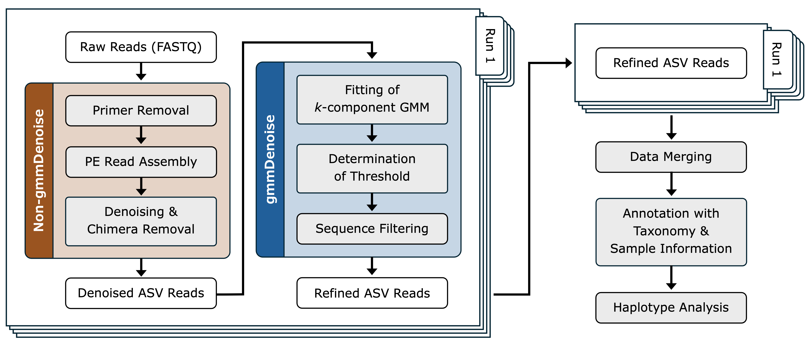

<!-- README.md is generated from README.Rmd. Please edit that file -->

```{r, include = FALSE}
knitr::opts_chunk$set(
  collapse = TRUE,
  comment = "#>",
  fig.path = "man/figures/README-",
  out.width = "100%"
)
```

# gmmDenoise 

<!-- badges: start -->
[](https://github.com/YSKoseki/gmmDenoise/actions/workflows/R-CMD-check.yaml)
-blue)
[](https://zenodo.org/badge/latestdoi/489551728)
<!-- badges: end -->

## Overview

`gmmDenoise` is an R package for the effective filtering of erroneous amplicon sequence variants (ASVs) in eDNA metabarcoding data, based on Gaussian mixture models (GMMs), to enable accurate intraspecific diversity estimates and population genetic inferences. The package provides functions for selecting the number of mixture components (*k*) for an ASV abundance distribution, fitting a *k*-component GMM to the distribution, and determining a statistically validated abundance threshold for ASV filtering based on the fitted model. It also includes functions for visualizing these processes.

## Installation

```{r, eval = FALSE}
# install.packages("devtools")
devtools::install_github("YSKoseki/gmmDenoise")
```

## Example workflow
### Step 1. Load the package
```{r, message = FALSE}
library(gmmDenoise)
```

### Step 2. Load and inspect the example dataset
```{r, warning = FALSE, results = 'hide', out.width = "50%"}
# mifish dataset: a vector of 1,217 ASV read counts, labeled with assigned  
# taxonomic names and ID numbers
data(mifish)
head(mifish, n = 10)
length(mifish)
summary(mifish)

# Plot a frequency histogram for visual inspection of ASV read count distribution
asvhist(mifish)

# A density histogram, rather than a frequency histogram, with the number of bins
# arbitrary set to 30, for example
asvhist(mifish, type = "density", nbins = 30)
```

### Step 3. Log-transform the read counts
```{r, warning = FALSE}
# Log-transformation to normalize the data and stabilize variance
logmf <- log10(mifish)
```

### Step 4. Select the number of components of Gaussian mixture model, *k*
#### Option 1: Split-half cross-validation
```{r, warning = FALSE, results = 'hide', out.width = "50%"}
# Set a random seed for reproducibility
set.seed(101)

# Perform the cross-validation
cv <- gmmcv(logmf, epsilon = 1e-02) # see ?gmmcv for details

# Display the cross-validation result, i.e., fitted log-likelihood value and 
# its confidence interval against k
autoplot(cv)  # equivalent to `autoplot.gmmcv(cv)`
```

#### Option2: Sequential parametric bootstrap tests 
```{r, warning = FALSE, results = 'hide', out.width = "50%"}
set.seed(101)

# Perform the bootstrap tests; it may take time (8 sec on an M1 MacBook Pro)
bs <- gmmbs(logmf, B = 100, epsilon = 1e-02) # see ?gmmbs for details
summary(bs)

# Display the bootstrap test result, i.e., a series of histograms of bootstrap 
# likelihood ratio statistic for each test step (comparing k vs. k+1)
p <- autoplot(bs)  # equivalent to `p <- autoplot.gmmbs(bs)`
library(cowplot)
cowplot::plot_grid(plotlist = p, ncol = 2)
```

Both analyses above suggest that the most likely number of mixture components, *k*, is 3.

### Step 5. Fit a GMM with the selected number of components
```{r, warning = FALSE, results = 'hide', out.width = "50%"}
set.seed(101)

# Fit a GMM with k = 3
mod <- gmmem(logmf, k = 3)

# Display the fitted GMM
autoplot(mod) # equivalent to `autoplot.gmmem(mod)`
```

### Step 6. Determine a filtering threshold and perform ASV filtering
```{r, warning = FALSE, results = 'hide', out.width = "50%"}
# quantile.gmmem() returns, by default, the upper one-sided 95% confidence limit 
# of the second uppermost component as the statistically validated abundance
# threshold value
thresh <- quantile(mod) # equivalent to `thresh <- quantile.gmmem(mod)`

# The fitted GMM with the threshold value
autoplot(mod, vline = thresh)

# Filter ASVs with the threshold value
logmf2 <- logmf[which(logmf > thresh)]
mifish2 <- mifish[which(logmf > thresh)]
length(mifish2)
summary(mifish2)
```

## Best practices
This is our recommended workflow for processing eDNA metabarcoding data for genetic diversity analysis, using `gmmDenoise` along with other tools. In this workflow, steps from primer removal of raw sequence reads (FASTQ files) through `gmmDenoise` filtering are performed separately for each sequencing run. The subsequent analysis is then conducted on a combined dataset, in which all runs have been merged.



>Figure design inspired by that of the GATK ["Best Practices for Variant Discovery in DNAseq"](https://github.com/broadinstitute/gatk-docs/blob/master/gatk3-methods-and-algorithms/Best_Practices_for_Variant_Discovery_in_DNAseq.md#best-practices-for-variant-discovery-in-dnaseq) by Geraldine_VdAuwera.

We recommend running gmmDenoise separately for each sequencing run. Although a more stringent approach would be to apply it to individual samples within a run, our preliminary analysis indicated that this was not practical&mdash;likely due to insufficient information on the ASV read count distribution within single samples, which depends on the number of ASVs and their read count variation.

As illustrated in the workflow above (the "Denoising & Chimera Removal" step), `gmmDenoise` can work complementarily with existing denoising algorithms, such as `DADA2` (Callahan et al. 2016) and `UNOISE3` (Edgar 2016). Our analyses (Koseki et al., 2025) indicate that this complementary use enhance denoising performance, resulting in fewer false-positive ASVs.

References:

- Callahan, B. J., McMurdie, P. J., Rosen, M. J., Han, A. W., Johnson, A. J. A., & Holmes, S. P. (2016). *DADA2*: High-resolution sample inference from Illumina amplicon data. Nature Methods, 13(7), 581—583.
- Edgar, R. C. (2016). *UNOISE2*: Improved error-correction for Illumina 16S and ITS amplicon sequencing. bioRxiv, 081257.
- Koseki, Y., Takeshima, H., Yoneda, R., Katayanagi, K., Ito, G., & Yamanaka, H. (2025). *gmmDenoise*: a new method and *R* package for high-confidence sequence variant filtering in environmental DNA amplicon analysis. Molecular Ecology Resources. Advance online publication. [https://doi.org/10.1111/1755-0998.70023](https://doi.org/10.1111/1755-0998.70023). 

## Cite as
<!--
[](https://zenodo.org/badge/latestdoi/489551728)

The above DOI corresponds to the latest versioned release as [published to Zenodo](https://zenodo.org/records/15015857), where you will find all earlier releases. To cite `gmmDenoise` independent of version, use https://doi.org/10.5281/zenodo.15015857, which will always redirect to the latest release.
-->

To cite `gmmDenoise` in publications, please use:

Koseki, Y., Takeshima, H., Yoneda, R., Katayanagi, K., Ito, G., & Yamanaka, H. (2025). *gmmDenoise*: a new method and *R* package for high-confidence sequence variant filtering in environmental DNA amplicon analysis. Molecular Ecology Resources. Advance online publication. [https://doi.org/10.1111/1755-0998.70023](https://doi.org/10.1111/1755-0998.70023).

A BibTeX entry for LateX users is [here](inst/CITATION).

<!--
You'll still need to render `README.Rmd` regularly, to keep `README.md` up-to-date. `devtools::build_readme()` is handy for this. You could also use GitHub Actions to re-render `README.Rmd` every time you push. An example workflow can be found here: <https://github.com/r-lib/actions/tree/v1/examples>.
-->

