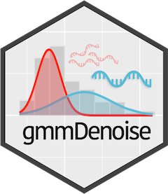

<!-- README.md is generated from README.Rmd. Please edit that file -->

```{r, include = FALSE}
knitr::opts_chunk$set(
  collapse = TRUE,
  comment = "#>",
  fig.path = "man/figures/README-",
  out.width = "100%"
)
```

# gmmDenoise 

<!-- badges: start -->
[](https://github.com/YSKoseki/gmmDenoise/actions/workflows/R-CMD-check.yaml)
-blue)

<!-- badges: end -->

# Overview

gmmDenoise is an R package for erroneous amplicon sequence variant (ASV) filtering in eDNA metabarcoding data on the basis of Gaussian mixture modeling (GMM) for accurate intraspecific diversity estimates and population genetic inferences. The package provides functions for selecting the number of components of GMM using cross-validation and parametric bootstrap tests, fitting GMM, and filtering ASVs based on the fitted GMM. The package also includes functions for visualizing the results of the GMM fitting and filtering processes.

## Installation

```{r, eval = FALSE}
# install.packages("devtools")
devtools::install_github("YSKoseki/gmmDenoise")
```

## Example

This is an example of how gmmDenoise works for filtering erroneous ASVs.

```{r, message = FALSE}
library(gmmDenoise)
```

```{r example, warning = FALSE, results = 'hide', out.width = "50%"}
# Data: a vector of 1,217 ASV read counts, named with assigned taxonomic names
# and [ID numbers]
data(mifish)
head(mifish, n = 10)
length(mifish)
summary(mifish)


# Plot histogram for visual inspection of ASV read count distribution
asvhist(mifish)
asvhist(mifish, type = "density", nbins = 30, xlim = c(1, 6))

# Cross-validation for selecting the number of components of Gaussian
# mixture model
logmf <- log10(mifish)
set.seed(101)
cv <- gmmcv(logmf, epsilon = 1e-03)
autoplot(cv)  # equivalent to `autoplot.gmmcv(cv)`

# An alternative approach for the number of mixture components: Sequential
# parametric bootstrap tests 
set.seed(101)
# May take some time
bs <- gmmbs(logmf, B = 100, epsilon = 1e-03)
p <- autoplot(bs)  # equivalent to `p <- autoplot.gmmbs(bs)`
library(cowplot)
plot_grid(plotlist = p, ncol = 2)
summary(bs)

# Fit a 3-component Gaussian mixture model and display a graphical representation
# of the output
set.seed(101)
mod <- gmmem(logmf, k = 3)
autoplot(mod) # equivalent to `autoplot.gmmem(mod)`
thresh <- quantile(mod, comp = 2)
autoplot(mod, vline = c(NA, thresh, NA))

# Filter ASVs with the threshold value
logmf2 <- logmf[which(logmf > thresh)]
mifish2 <- mifish[which(logmf > thresh)]
asvhist(mifish2)
length(mifish2)
summary(mifish2)
```

<!--
You'll still need to render `README.Rmd` regularly, to keep `README.md` up-to-date. `devtools::build_readme()` is handy for this. You could also use GitHub Actions to re-render `README.Rmd` every time you push. An example workflow can be found here: <https://github.com/r-lib/actions/tree/v1/examples>.
-->

