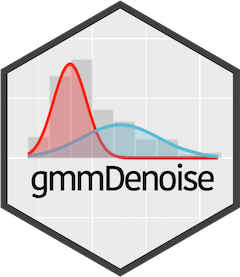
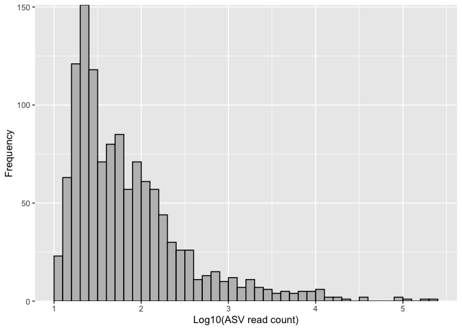
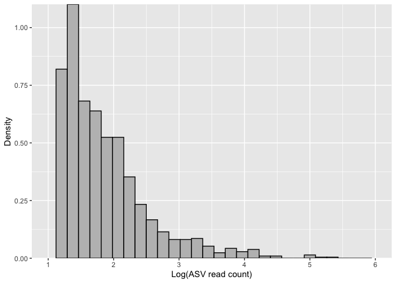
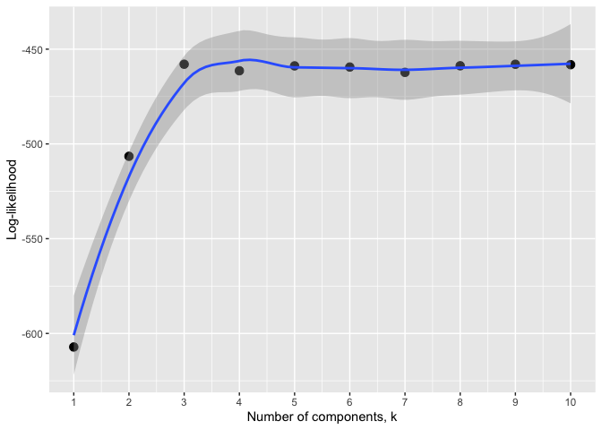
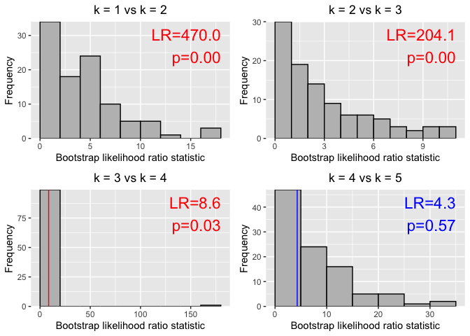
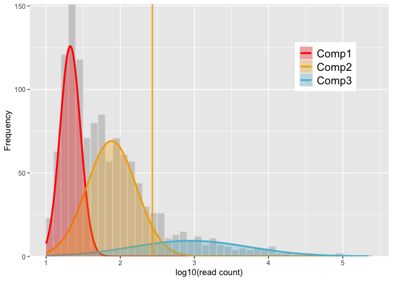
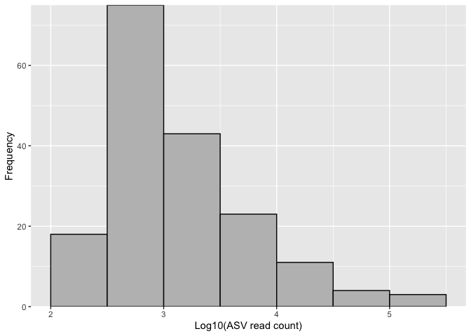

<!-- README.md is generated from README.Rmd. Please edit that file -->

# gmmDenoise 

<!-- badges: start -->

[](https://github.com/YSKoseki/gmmDenoise/actions/workflows/R-CMD-check.yaml)
-blue)
[](https://zenodo.org/badge/latestdoi/489551728)
<!-- badges: end -->

## Overview

gmmDenoise is an R package for the effective filtering of erroneous
amplicon sequence variants (ASVs) in eDNA metabarcoding data, based on
Gaussian mixture models (GMMs), to enable accurate intraspecific
diversity estimates and population genetic inferences. The package
provides functions for selecting the number of mixture components (*k*)
for an ASV abundance distribution, fitting a *k*-component GMM to the
distribution, and determining a statistically validated abundance
threshold for ASV filtering based on the fitted model. It also includes
functions for visualizing these processes.

## Installation

``` r
# install.packages("devtools")
devtools::install_github("YSKoseki/gmmDenoise")
```

## Example workflow

This is an example of how gmmDenoise works for filtering erroneous ASVs.

``` r
library(gmmDenoise)
```

``` r
# Data: a vector of 1,217 ASV read counts, named with assigned taxonomic names
# and [ID numbers]
data(mifish)
head(mifish, n = 10)
length(mifish)
summary(mifish)


# Plot histogram for visual inspection of ASV read count distribution
asvhist(mifish)
```



``` r

# The density version with the number of bins arbitrary set at 30
asvhist(mifish, type = "density", nbins = 30)
```



``` r

# Log-transformed data
logmf <- log10(mifish)

# Cross-validation for selecting the number of components of Gaussian
# mixture model
set.seed(101)
cv <- gmmcv(logmf, epsilon = 1e-02)
autoplot(cv)  # equivalent to `autoplot.gmmcv(cv)`
```



``` r

# The alternative approach for the number of mixture components: Sequential
# parametric bootstrap tests 
set.seed(101)
# May take some time (8 sec on my M1 MacBook Pro)
bs <- gmmbs(logmf, B = 100, epsilon = 1e-02)
summary(bs)
p <- autoplot(bs)  # equivalent to `p <- autoplot.gmmbs(bs)`
library(cowplot)
plot_grid(plotlist = p, ncol = 2)
```



``` r

# Fit a 3-component Gaussian mixture model and display a graphical representation
# of the fitted model
set.seed(101)
mod <- gmmem(logmf, k = 3)
autoplot(mod) # equivalent to `autoplot.gmmem(mod)`
```


``` r

# Determine the cutoff threshold (default is the upper one-sided 95% confidence 
# limit of the second uppermost component) 
thresh <- quantile(mod)
autoplot(mod, vline = thresh)
```



``` r

# Filter ASVs with the threshold value
logmf2 <- logmf[which(logmf > thresh)]
mifish2 <- mifish[which(logmf > thresh)]
length(mifish2)
summary(mifish2)
asvhist(mifish2)
```



## Cite as

[](https://zenodo.org/badge/latestdoi/489551728)

The above DOI corresponds to the latest versioned release as [published
to Zenodo](https://zenodo.org/records/15015857), where you will find all
earlier releases. To cite gmmDenoise independent of version, use
<https://doi.org/10.5281/zenodo.15015857>, which will always redirect to
the latest release.

<!--
You'll still need to render `README.Rmd` regularly, to keep `README.md` up-to-date. `devtools::build_readme()` is handy for this. You could also use GitHub Actions to re-render `README.Rmd` every time you push. An example workflow can be found here: <https://github.com/r-lib/actions/tree/v1/examples>.
-->
